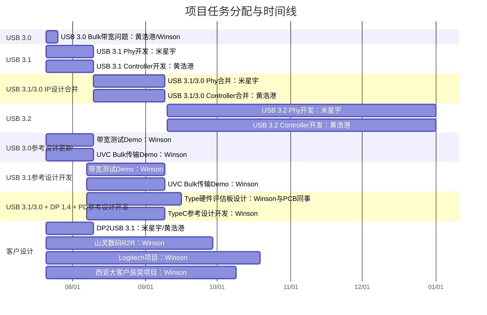

```mermaid
gantt
    title 项目任务分配与时间线
    dateFormat  YYYY-MM-DD
    axisFormat  %m/%d

    section USB 3.0
    USB 3.0 Bulk带宽问题：黄浩港/Winson   :    task1, 2025-07-21, 5d

    section USB 3.1
    USB 3.1 Phy开发：米星宇      :         task2, 2025-07-21, 20d
    USB 3.1 Controller开发：黄浩港      :  task3, 2025-07-21, 20d

    section USB 3.1/3.0 IP设计合并
    USB 3.1/3.0 Phy合并：米星宇       :    task4, 2025-08-10, 30d
    USB 3.1/3.0 Controller合并：黄浩港:    task5, 2025-08-10, 30d

    section USB 3.2
    USB 3.2 Phy开发：米星宇      :         task2, 2025-09-10, 113d
    USB 3.2 Controller开发：黄浩港      :  task3, 2025-09-10, 113d

    section USB 3.0参考设计更新
    带宽测试Demo：Winson       :         task6, 2025-07-21, 20d
    UVC Bulk传输Demo：Winson   :        task7, 2025-07-21, 20d

    section USB 3.1参考设计开发
    带宽测试Demo：Winson       :         task8, 2025-08-07, 33d
    UVC Bulk传输Demo：Winson   :         task9, 2025-08-07, 33d

    section USB 3.1/3.0 + DP 1.4 + PD参考设计开发
    Type硬件评估板设计：Winson与PCB同事       :         task10, 2025-08-07, 40d
    TypeC参考设计开发：Winson   :         task11, 2025-08-07, 33d

    section 客户设计
    DP2USB 3.1：米星宇/黄浩港      :task12, 2025-07-21, 20d
    山灵数码R2R：Winson :             task13, 2025-07-21, 70d
    Logitech项目：Winson :            task14, 2025-07-21, 90d
    西安大客户辰奕项目：Winson :       task15, 2025-07-21, 80d
```