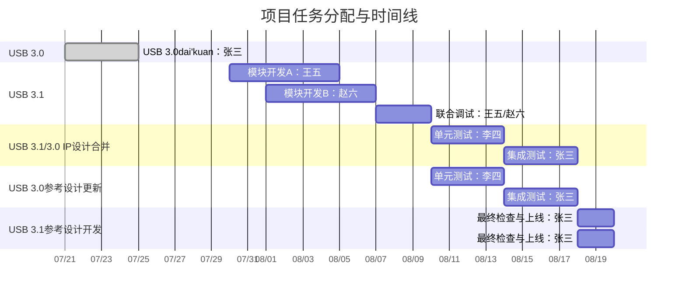

```mermaid
gantt
    title 项目任务分配与时间线
    dateFormat  YYYY-MM-DD
    axisFormat  %m/%d

    section USB 3.0
    USB 3.0dai'kuan：张三       :done,    task1, 2025-07-21, 4d

    section USB 3.1
    模块开发A：王五      :         task3, 2025-07-30, 6d
    模块开发B：赵六      :         task4, 2025-08-01, 6d
    联合调试：王五/赵六  :         task5, 2025-08-07, 3d

    section USB 3.1/3.0 IP设计合并
    单元测试：李四       :         task6, 2025-08-10, 4d
    集成测试：张三       :         task7, 2025-08-14, 4d

    section USB 3.0参考设计更新
    单元测试：李四       :         task6, 2025-08-10, 4d
    集成测试：张三       :         task7, 2025-08-14, 4d

    section USB 3.1参考设计开发
    最终检查与上线：张三 :         task8, 2025-08-18, 2d

    section USB 3.1参考设计开发
    最终检查与上线：张三 :         task8, 2025-08-18, 2d

```