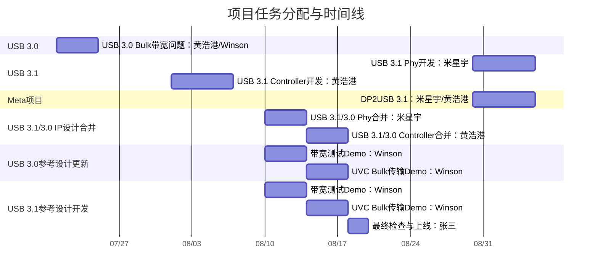

```mermaid
gantt
    title 项目任务分配与时间线
    dateFormat  YYYY-MM-DD
    axisFormat  %m/%d

    section USB 3.0
    USB 3.0 Bulk带宽问题：黄浩港/Winson   :    task1, 2025-07-21, 4d

    section USB 3.1
    USB 3.1 Phy开发：米星宇      :         task2, 2025-08-30, 6d
    USB 3.1 Controller开发：黄浩港      :  task3, 2025-08-01, 6d

    section Meta项目
    DP2USB 3.1：米星宇/黄浩港      :         task4, 2025-08-30, 6d

    section USB 3.1/3.0 IP设计合并
    USB 3.1/3.0 Phy合并：米星宇       :    task5, 2025-08-10, 4d
    USB 3.1/3.0 Controller合并：黄浩港       :         task7, 2025-08-14, 4d

    section USB 3.0参考设计更新
    带宽测试Demo：Winson       :         task6, 2025-08-10, 4d
    UVC Bulk传输Demo：Winson   :         task7, 2025-08-14, 4d

    section USB 3.1参考设计开发
    带宽测试Demo：Winson       :         task6, 2025-08-10, 4d
    UVC Bulk传输Demo：Winson   :         task7, 2025-08-14, 4d

    section USB 3.1参考设计开发
    最终检查与上线：张三 :         task8, 2025-08-18, 2d

```